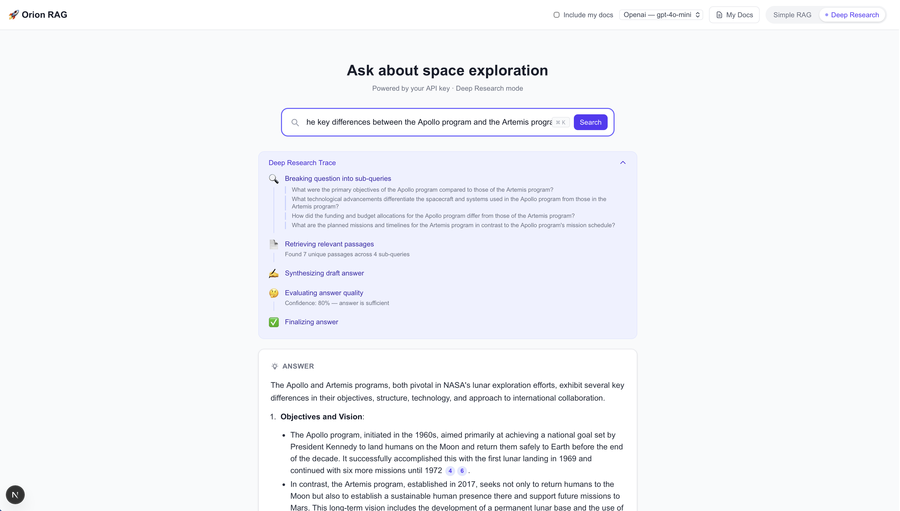
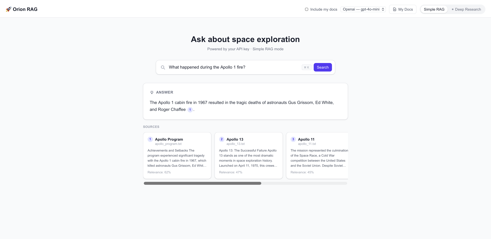
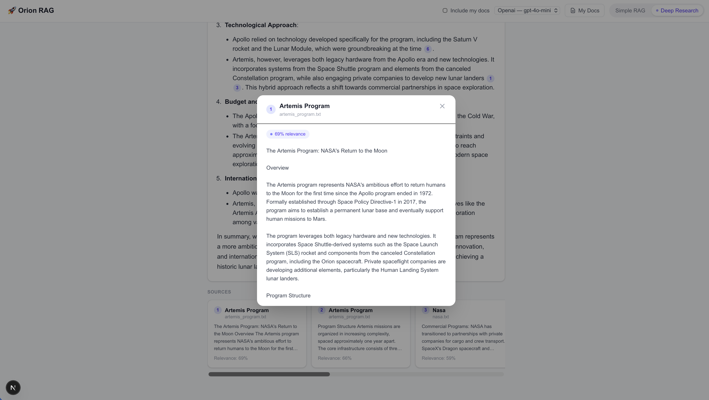

# Orion RAG


A full-stack **Retrieval-Augmented Generation (RAG)** pipeline with two distinct modes, a Glean-inspired UI, and bring-your-own-key support for multiple LLM providers.



## What is this?

Orion RAG is a portfolio project that demonstrates two different approaches to answering questions over a document corpus — from a straightforward vector search pipeline to a fully agentic multi-step research loop.

The bundled corpus covers **space exploration** (Apollo program, ISS, Mars rovers, SpaceX, Hubble, Voyager, and more), but the architecture is domain-agnostic: swap the corpus files and it works for any topic. Users can also upload their own documents at runtime.

---

## Modes

### Simple RAG
The standard pipeline. Fast and transparent.

```
Query → Embed → Similarity search (ChromaDB) → LLM call → Answer with inline citations
```

Each answer includes numbered citation badges that scroll to the corresponding source card. Source cards show a snippet preview; clicking one opens a modal with the full passage.

### Deep Research
An agentic pipeline built with **LangGraph** that mirrors how a researcher actually works. Each step streams to the UI in real time so you can watch the reasoning unfold.

```
Query
  ↓ decompose    — LLM breaks the question into 2–4 focused sub-queries
  ↓ retrieve     — parallel similarity search for each sub-query
  ↓ synthesize   — LLM drafts a comprehensive answer from all evidence
  ↓ reflect      — LLM scores its own answer; re-queries if confidence < 70%
  ↓ finalize     — formats the final answer with numbered citations
```

The thinking trace is collapsible and shows exactly which sub-queries were generated, how many passages were retrieved, the confidence score, and whether a re-query was triggered.

---

## Screenshots

| Simple RAG | Source detail |
|---|---|
|  |  |

---

## Stack

| Layer | Technology | Why |
|---|---|---|
| Backend | **FastAPI** | Async, clean OpenAPI docs, SSE streaming |
| LLM routing | **LiteLLM** | Single interface across OpenAI, Anthropic, Gemini, Mistral |
| Agentic loop | **LangGraph** | Stateful multi-step graph with conditional edges |
| Embeddings | **sentence-transformers** (`all-MiniLM-L6-v2`) | Runs locally — no API key required for indexing |
| Vectorstore | **ChromaDB** | In-process, persistent, supports named collections |
| Document parsing | **pypdf + python-docx** | PDF, DOCX, TXT, MD support |
| Frontend | **Next.js 14 + Tailwind CSS** | App router, SSE consumer, responsive layout |

---

## Architecture

```
┌─────────────────────────────────────────────┐
│                  Frontend                    │
│  SearchBar · ModeToggle · AnswerPanel        │
│  ThinkingTrace · SourceCards · DocManager   │
└───────────────────┬─────────────────────────┘
                    │ REST / SSE
┌───────────────────▼─────────────────────────┐
│                FastAPI Backend               │
│                                             │
│  POST /api/query      → Simple RAG chain    │
│  POST /api/research   → LangGraph graph     │
│  POST /api/documents  → Upload & index      │
│  GET  /api/health     → Provider detection  │
│                                             │
│  ┌──────────────┐    ┌─────────────────┐   │
│  │  ChromaDB    │    │   LiteLLM       │   │
│  │  bundled ──┐ │    │  openai         │   │
│  │  user ─────┘ │    │  anthropic      │   │
│  └──────────────┘    │  gemini         │   │
│                      │  mistral        │   │
│  sentence-           └─────────────────┘   │
│  transformers (local embeddings)            │
└─────────────────────────────────────────────┘
```

Two ChromaDB collections run side by side:
- **`bundled`** — pre-indexed corpus, created automatically on first startup
- **`user`** — documents uploaded at runtime, persisted across restarts

---

## Setup

### 1. Clone and configure

```bash
git clone https://github.com/JosephS96/orion-rag.git
cd orion-rag
cp .env.example .env
```

Edit `.env` and add at least one provider key:

```bash
OPENAI_API_KEY=sk-...
# or
ANTHROPIC_API_KEY=sk-ant-...
# or
GEMINI_API_KEY=...
# or
MISTRAL_API_KEY=...
```

The app detects which keys are present at startup and only shows those providers in the UI.

### 2. Run with Docker Compose

```bash
docker-compose up --build
```

- Frontend → http://localhost:3000
- Backend API docs → http://localhost:8000/docs

### 3. Run locally (without Docker)

**Backend:**
```bash
pip install -r requirements.txt
uvicorn backend.main:app --reload --port 8000
```

**Frontend:**
```bash
cd frontend
npm install
cp .env.local.example .env.local
npm run dev
```

> On first startup the backend automatically indexes the bundled corpus into ChromaDB. This takes ~10 seconds while the embedding model loads.

---

## Bundled Corpus

15 Wikipedia articles covering space exploration, bundled as plain `.txt` files in `backend/data/corpus/`:

Apollo 11 · Apollo 13 · Apollo Program · Artemis Program · Falcon 9 · Hubble Space Telescope · International Space Station · James Webb Space Telescope · Mars Exploration · NASA · Perseverance Rover · Saturn V · Space Shuttle · SpaceX · Voyager Program

These are chunked (800 tokens, 150 overlap) and indexed with local embeddings on first run — no API key needed for indexing.

---

## Adding Your Own Documents

Click **My Docs** in the top-right corner to upload files. Supported formats: **PDF, DOCX, TXT, Markdown**.

Toggle **Include my docs** in the header to search your documents alongside (or instead of) the bundled corpus.

---

## Project Structure

```
orion-rag/
├── backend/
│   ├── main.py                      # FastAPI entry point, corpus auto-index on startup
│   ├── config/settings.py           # Pydantic settings, provider detection
│   ├── rag/
│   │   ├── embeddings.py            # sentence-transformers wrapper
│   │   ├── vectorstore.py           # ChromaDB: bundled + user collections
│   │   ├── loader.py                # Document parsing and chunking
│   │   ├── retriever.py             # Cosine similarity search
│   │   ├── simple_chain.py          # Simple RAG pipeline
│   │   └── deep_research/
│   │       ├── graph.py             # LangGraph StateGraph definition
│   │       ├── nodes.py             # decompose / retrieve / synthesize / reflect
│   │       └── tools.py             # vectorstore search tool
│   ├── api/routes/                  # query · research · documents · health
│   └── data/corpus/                 # Bundled Wikipedia articles (.txt)
├── frontend/
│   ├── app/page.tsx                 # Main search page
│   ├── components/
│   │   ├── SearchBar.tsx            # ⌘K focused search input
│   │   ├── ModeToggle.tsx           # Simple RAG / Deep Research switch
│   │   ├── AnswerPanel.tsx          # Markdown answer with citation badges
│   │   ├── SourceCard.tsx           # Source preview card + detail modal
│   │   ├── ThinkingTrace.tsx        # Live SSE-driven reasoning steps
│   │   └── DocumentManager.tsx     # Upload / list / delete drawer
│   └── lib/api.ts                   # Typed fetch wrappers + SSE stream
├── docker-compose.yml
├── .env.example
└── requirements.txt
```
